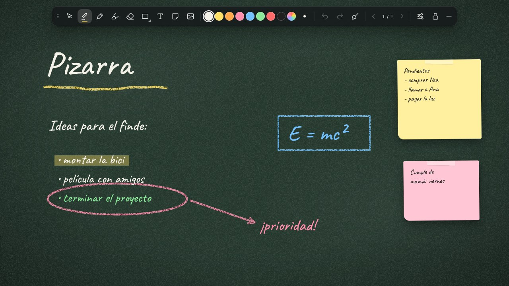

# Blackboard — interactive wallpaper



A Windows wallpaper that works as a blackboard: draw with chalk, write notes, paste images and organize your ideas right on your desktop. Everything is saved automatically.

> The app's interface is in Spanish. Button names are quoted below with their English meaning.

## Features

- **Brushes**: textured chalk, marker, highlighter and eraser.
- **Shapes**: line, arrow, rectangle and ellipse.
- **Text and sticky notes**, in handwritten fonts (Segoe Print, Ink Free) or others.
- **Images**: insert, move, resize and draw on top of them.
- **Select**: move, resize, duplicate, bring to front, recolor and delete.
- **Multiple pages**, each with its own undo and redo.
- **Backgrounds**: green chalkboard, black, graphite, blue, whiteboard or a custom color, plus an optional grid, dot or ruled-line guide.
- **On-screen keyboard** with uppercase, Spanish accents, ñ and symbols.
- **Lock**: the board stops reacting to clicks.
- **Auto-save**: drawings, text, images and settings are kept across restarts.

---

## Where to install it

| | Lively Wallpaper (**recommended**) | Wallpaper Engine |
|---|---|---|
| Price | Free and open source | Paid (Steam) |
| Mouse (draw, move) | ✅ | ✅ |
| Physical keyboard | ✅ (must be enabled) | ❌ Not available |
| Typing text | Physical or on-screen keyboard | On-screen keyboard only |
| Shortcuts (Ctrl+Z, etc.) | ✅ | ❌ |

### ⚠️ Wallpaper Engine does not support keyboard input

Wallpaper Engine **does not forward keyboard input to web wallpapers**. Its developers have explained on the Steam forums that Windows restricts keyboard input on the desktop and that support for web wallpapers is limited and unreliable. On top of that, keys you type on the desktop go to Windows Explorer, not to the wallpaper.

In Wallpaper Engine the board works with the mouse, but you can only type with the project's built-in **on-screen keyboard**, and keyboard shortcuts don't work.

That's why **Lively Wallpaper** is the recommended way to install it.

---

## Installing with Lively Wallpaper (recommended)

1. Install **Lively Wallpaper** from the Microsoft Store or from [its GitHub page](https://github.com/rocksdanister/lively).
2. Open Lively and **drag the `index.html` file** (or the project folder) into the Lively window.
3. Set the board as your wallpaper.
4. Enable the keyboard under
   **Settings (⚙) → Wallpaper → Interaction → Wallpaper Input → Keyboard**.

> **Note:** when the keyboard is enabled, Lively hides your desktop icons. This keeps Windows Explorer from grabbing your keystrokes, and as a bonus the blue selection rectangle no longer appears while you draw.

### Optional: show or hide the icons with a shortcut

Lively includes a command-line tool (`Livelycu.exe`) that shows or hides the desktop icons. With [AutoHotkey v2](https://www.autohotkey.com/) you can switch between "board mode" and "normal desktop" with **Ctrl + Alt + P**:

```ahk
#Requires AutoHotkey v2.0
; Adjust the path to match how you installed Lively (installer or Microsoft Store)
lively := EnvGet("LOCALAPPDATA") "\Programs\Lively Wallpaper\Livelycu.exe"
iconsVisible := true

^!p:: {   ; Ctrl + Alt + P
    global iconsVisible
    iconsVisible := !iconsVisible
    Run('"' lively '" --showIcons ' (iconsVisible ? "true" : "false"), , "Hide")
    ToolTip(iconsVisible ? "Normal desktop" : "Board mode")
    SetTimer(() => ToolTip(), -1200)
}
```

To have the shortcut available at startup, save the script and put a shortcut to it in your Startup folder (`Win + R` → `shell:startup`).

## Installing with Wallpaper Engine

1. In Wallpaper Engine, click **Open wallpaper → Open from file** and select `project.json` (or `index.html`).
2. In Wallpaper Engine's settings, make sure **mouse input** is enabled; otherwise you won't be able to draw.
3. To type, use the **on-screen keyboard**. It appears automatically when you create or edit a text or a note.

**Tip:** if the blue selection rectangle bothers you while drawing, hide your desktop icons: right-click the desktop → **View** → uncheck **Show desktop icons**.

---

## Usage

| Tool | What it does |
|---|---|
| Select | Moves and resizes text, notes and images. Double-click a text to edit it. |
| Chalk, marker, highlighter | Draw with the chosen color and size. |
| Eraser | Erases strokes (not text, notes or images). |
| Shapes | Click the button to choose line, arrow, rectangle or ellipse. |
| Text and note | Click on the board to create one; click outside or press **"Listo"** (Done) to finish. |
| Clear (broom) | Empties the page. Can be undone from the pop-up notice ("Deshacer" = Undo). |
| Pages | Arrows switch pages; click the page number to add or delete pages. |
| Settings | Background, guide, font and texture. |
| Lock | Locks the board so desktop clicks don't draw. |
| — (collapse) | Shrinks the toolbar. Drag it by the dots on its left edge. |

### Keyboard shortcuts (Lively or browser)

| Shortcut | Action |
|---|---|
| `Ctrl + Z` / `Ctrl + Y` | Undo / redo |
| `V` `B` `M` `H` `E` `S` `T` `N` | Select, chalk, marker, highlighter, eraser, shapes, text, note |
| `[` / `]` | Smaller / larger size |
| `Delete` | Delete the selected item |
| `Esc` | Finish typing or clear the selection |
| `Ctrl + V` | Paste an image from the clipboard |

You can also **drag an image** from File Explorer onto the board (works in a browser; may not work as a wallpaper).

---

## Where your data is stored

Content is saved automatically in the internal storage (IndexedDB) of whichever program displays the wallpaper. Keep in mind that:

- Lively and Wallpaper Engine store data **separately**: what you draw in one won't appear in the other.
- Images are scaled down to a maximum of 1600 px so storage doesn't fill up.

## Project files

| File | Contents |
|---|---|
| `index.html` | Board structure, toolbar and icons |
| `styles.css` | Styles |
| `script.js` | All logic: drawing, objects, history, saving, on-screen keyboard |
| `project.json` | Wallpaper description for Wallpaper Engine |
| `preview.jpg` | Preview image |

## Testing in a browser

Open `index.html` in Chrome or Edge. It works the same as the wallpaper, physical keyboard included. It's the quickest way to try out changes.
